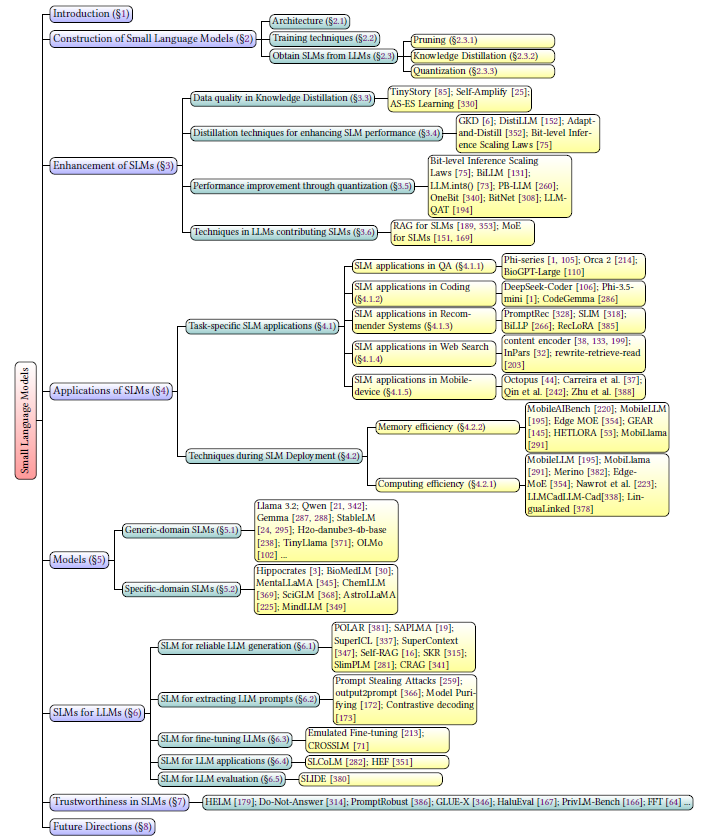
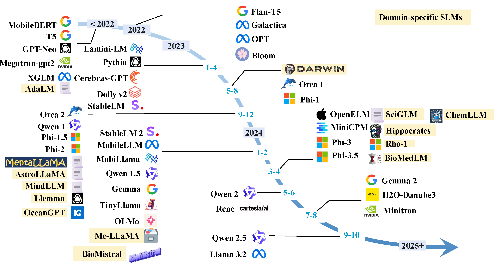

# SLM Survey

## A Comprehensive Survey of Small Language Models: Technology, On-Device Applications, Efficiency, Enhancements for LLMs, and Trustworthiness

> TBD - Contact Information
>
> If you find this survey useful for your research, please cite the following paper:

```
[TBD - BibTeX citation link here]
```

## Table of Contents

- [SLM Survey](#slm-survey)
  - [Table of Contents](#table-of-contents)
  - [Overview of SLMs](#overview-of-slms)
  - [Timeline of SLMs](#timeline-of-slms)
  - [SLM Ppaer List](#slm-paper-list)
    - [Foundational Concepts in Building Language Models](#foundational-concepts-in-building-language-models)
    - [Advanced enhancement methods for SLM](#advanced-enhancement-methods-for-slm)
      - [Training from scratch](#training-from-scratch)
      - [Supervised fine-tuning](#supervised-fine-tuning)
      - [Data quality in KD](#data-quality-in-kd)
      - [Distillation for SLM](#distillation-for-slm)
      - [Quantization](#quantization)
      - [LLMs for SLM](#llms-for-slm)
    - [Task-specific SLM Applications](#task-specific-slm-applications)
      - [SLM in QA](#slm-in-qa)
      - [SLM in Coding](#slm-in-coding)
      - [SLM in Recommendation](#slm-in-recommendation)
      - [SLM in Web Search](#slm-in-web-search)
      - [SLM in Mobile-device](#slm-in-mobile-device)
    - [On-device Deployment Optimization Techniques](#on-device-deployment-optimization-techniques) 
      - [Memory Efficiency Optimization](#memory-efficiency-optimization)
      - [Runtime Efficiency Optimization](#runtime-efficiency-optimization)
  
## Overview of SLMs


## Timeline of SLMs


## SLM Paper List

### Foundational Concepts in Building Language Models

| Method        | Bit           | Type  | Notable Benefits                       | Year      | Paper       | Code   | Model Card |
|---------------| --------------|-------|----------------------------------------|-----------|-------------|----------|--------------|
| SqueezeLLM    | 3-bit         | PTQ   | Ultra-low bit quantization             | 2023      | [Link](https://arxiv.org/abs/2306.07629)               | [Link](https://github.com/SqueezeAILab/SqueezeLLM)               |   | 
| JSQ           | Flexible      | PTQ   | Better compression-accuracy trade-offs | 2024      | [Link](https://proceedings.mlr.press/v235/guo24g.html) | [Link](https://github.com/uanu2002/JSQ)                          |   |
| FrameQuant    | Fractional bit| PTQ   | Better compression-accuracy trade-offs | 2024      | [Link](https://arxiv.org/abs/2403.06082)               | [Link](https://github.com/vsingh-group/FrameQuant)               |   |
| OneBit        | 1-bit         | PTQ   | 1-bit quantization                     | 2024      | [Link](https://arxiv.org/abs/2402.11295)               |                                                                  |   |
| BiLLM         | 1-bit         | PTQ   | 1-bit quantization                     | 2024      | [Link](https://arxiv.org/abs/2402.04291)               | [Link](https://github.com/Aaronhuang-778/BiLLM)                  |   |
| LQER          | Flexible      | PTQ   | Better compression-accuracy trade-offs | 2024      | [Link](https://arxiv.org/abs/2402.02446)               | [Link](https://github.com/ChengZhang-98/lqer)                    |   |
| I-LLM         | Flexible      | PTQ   | Integer-only Quantization              | 2024      | [Link](https://arxiv.org/abs/2405.17849)               | [Link](https://anonymous.4open.science/r/I-LLM-F242/README.md)   |   |
| PV-Tuning     | 1-bit/2-bit   | PTQ   | Better compression-accuracy trade-offs | 2024      | [Link](https://arxiv.org/abs/2405.14852)               |                                                                  |   |
| BitNet        | 1-bit         | QAT   | 1-bit quantization                     | 2023      | [Link](https://arxiv.org/abs/2310.11453)               |                                                                  |   |
| BitNet b1.58  | {-1, 0, 1}    | QAT   | 1-bit quantization                     | 2024      | [Link](https://arxiv.org/abs/2402.17764)               |                                                                  |   |
| PEQA          | Flexible      | QAT   | Parameter-Efficient Finetuning         | 2024      | [Link](https://dl.acm.org/doi/10.5555/3666122.3667691) |                                                                  |   |
| QLoRA         | NF4           | QAT   | Parameter-Efficient Finetuning         | 2024      | [Link](https://dl.acm.org/doi/abs/10.5555/3666122.3666563) | [Link](https://github.com/artidoro/qlora)           

### Advanced enhancement methods for SLM

#### Training from scratch

| Method        | Year | Paper | Code | Model Card |
|---------------|------|-------|------|------------|
| MindLLM       |      |       |      |            |
| MobiLlama     |      |       |      |            |
| MobileLLM     |      |       |      |            |

#### Supervised fine-tuning
| Method        | Year | Paper | Code | Model Card |
|---------------|------|-------|------|------------|
| MobileBERT    |      |       |      |            |
| Alpaca 7B     |      |       |      |            |
| RLHF          |      |       |      |            |
| DPO           |      |       |      |            |

#### Data quality in KD
| Method        | Year | Paper | Code | Model Card |
|---------------|------|-------|------|------------|
| TinyStory     |      |       |      |            |
| AS-ES         |      |       |      |            |
| Self-Amplify  |      |       |      |            |

#### Distillation for SLM
| Method        | Year | Paper | Code | Model Card |
|---------------|------|-------|------|------------|
| GKD           |      |       |      |            |
| DistilLLM     |      |       |      |            |
| Adapt-and-Distill | |       |      |            |

#### Quantization
| Method        | Year | Paper | Code | Model Card |
|---------------|------|-------|------|------------|
| SmoothQuant   |      |       |      |            |
| BiLLM         |      |       |      |            |
| LLM-QAT       |      |       |      |            |
| PB-LLM        |      |       |      |            |
| OneBit        |      |       |      |            |
| BitNet        |      |       |      |            |
| BitNet b1.58  |      |       |      |            |

#### LLMs for SLM
| Method        | Year | Paper | Code | Model Card |
|---------------|------|-------|------|------------|
| Ma et al.     |      |       |      |            |
| MoQE          |      |       |      |            |
| SLM-RAG       |      |       |      |            |


### Task-specific SLM Applications
#### SLM in QA
| Method        | Year | Paper | Code | Model Card |
|---------------|------|-------|------|------------|
| Alpaca        |      |       |      |            |
| Stable Beluga 7B  |      |   |      |            |
| Fine-tuned BioGPT Guo et al.  |      |           |      |            |
| Financial SLMs |      |       |      |            |
| ColBERT        |      |       |      |            |
| T-SAS          |      |       |      |            |
| Rationale Ranking     |       |      |      |            |

#### SLM in Coding
| Method        | Year | Paper | Code | Model Card |
|---------------|------|-------|------|------------|
| Phi-3.5-mini     |      |       |      |            |
| TinyLlama          |      |       |      |            |
| CodeLlama       |      |       |      |            |
| CodeGemma       |      |       |      |            |

#### SLM in Recommendation
| Method        | Year | Paper | Code | Model Card |
|---------------|------|-------|------|------------|
| PromptRec     |      |       |      |            |
| SLIM          |      |       |      |            |
| BiLLP       |      |       |      |            |
| LLaMa       |      |       |      |            |
| RecLoRA       |      |       |      |            |

#### SLM in Web Search
| Method        | Year | Paper | Code | Model Card |
|---------------|------|-------|------|------------|
| Content encoder     |      |       |      |            |
| Ranker          |      |       |      |            |
| Rewriter       |      |       |      |            |

#### SLM in Mobile-device
| Method        | Year | Paper | Code | Model Card |
|---------------|------|-------|------|------------|
| Octopus     |      |       |      |            |
| MobileAgent          |      |       |      |            |
| Revolutionizing Mobile Interaction       |      |       |      |            |
| AutoDroid       |      |       |      |            |
| On-device Agent for Text Rewriting       |      |       |      |            |


### On-device Deployment Optimization Techniques
#### Memory Efficiency Optimization
| Method        | Year | Paper | Code | Model Card |
|---------------|------|-------|------|------------|
| EDGE-LLM     |      |       |      |            |
| LLM-PQ          |      |       |      |            |
| AWQ       |      |       |      |            |
| MobileAIBench       |      |       |      |            |
| MobileLLM       |      |       |      |            |
| EdgeMoE       |      |       |      |            |
| GEAR       |      |       |      |            |
| DMC       |      |       |      |            |
| Transformer-Lite        |      |       |      |            |
| LLMaaS        |      |       |      |            |

#### Runtime Efficiency Optimization
| Method        | Year | Paper | Code | Model Card |
|---------------|------|-------|------|------------|
| EdgeMoE     |      |       |      |            |
| LLMCad          |      |       |      |            |
| LinguaLinked       |      |       |      |            |
